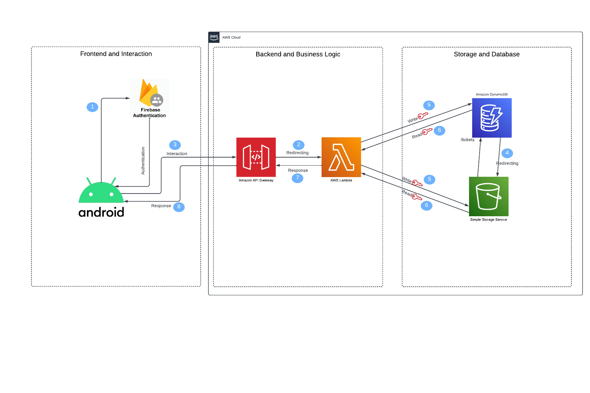

# Building Maintenance Reporting System

This project engages students in the maintenance of their buildings by allowing them to report issues via a mobile application. By scanning various QR codes in places like toilets, trash cans, etc., students can create tickets specifying problems and upload photos of the issues. The tickets are then assigned to staff members who address and resolve them, updating the ticket status and providing feedback with photos. An admin interface is also provided for user management and ticket analysis.

## Features

- **Issue Reporting**: Allows users to report maintenance issues by scanning QR codes.
- **Ticket Management**: Users can create, update, and delete tickets.
- **Photo Upload**: Users can upload photos of the issue for better clarity.
- **Staff Assignment**: Tickets are assigned to staff members (e.g., janitors) for resolution.
- **Status Tracking**: Users can track the status of their reports from pending to resolved.
- **Admin Interface**: Admins can manage users, monitor tickets, and view statistical reports.
- **AWS Integration**: Utilizes AWS for backend services including DynamoDB and S3.

## Project Flowchart



## Setup

1. **Clone the Repository**:
    ```sh
    git clone https://github.com/senemogluc/building-maintenance-app-aws
    ```

2. **Configuration**:
    - Modify the properties related to AWS setup according to your credentials.
    - Ensure that your AWS IAM roles have the necessary permissions for DynamoDB and S3 operations.

3. **Request Example**:

    ```json
    {
      "details": "The trash can is full",
      "image_base64": "<base64_encoded_image>",
      "user_id": "123",
      "username": "test-user",
      "address": "123 Main St",
      "building": "Engineering Building",
      "floor": "2",
      "place": "Restroom",
      "problem_header": "Trash Can Full"
    }
    ```

4. **Curl Command**:

    ```sh
    curl --location 'https://{your-api-id}.execute-api.{your-region}.amazonaws.com/{stage}/tickets/create
    ' \
    --data '{
        "details": "The trash can is full",
        "problem_header":"Trash Can Full",
        "user_id": "123",
        "username": "test-user",
        "address": "123 Main St",
        "place": "Restroom",
        "building": "Engineering Building",
        "floor": "2",
        "image_base64": "<base64_encoded_image>"
    }'
    ```

## Contributing

If you want to contribute to this project, please fork the repository and create a pull request with your changes. For major changes, please open an issue first to discuss what you would like to change.

## License

This project is licensed under the MIT License.

---

Feel free to customize this README further according to your specific needs.
